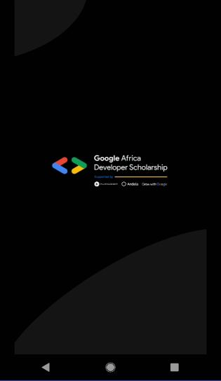
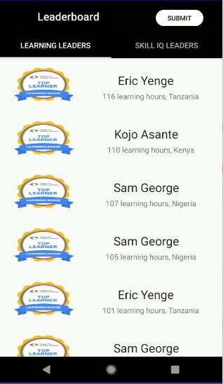
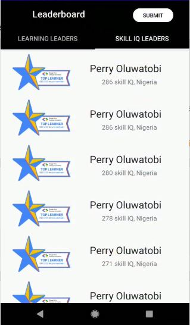
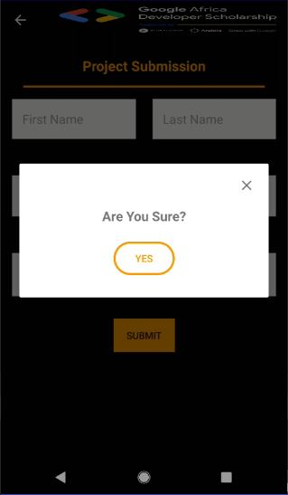
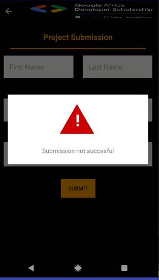
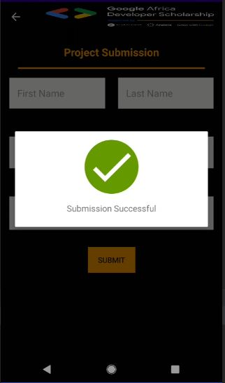

# Building a GADS Leaderboard Mobile Application

## Description

This project is a very simple Android Project aimed at implementinng some simple concepts that are very important as far as Android Development is concerned.

In this project, I implement a mobile design of the GADS 2020 Leaderboard.
The mobile App displays Top 20 learners in the Learning Leaders’ category and Top 20 learners in the Skill IQ Leaders’ category.

This project helped me understand:
- Multi-Activity Project
- View pager
- Customizing Toolbar
- RecyclerView
- Making Network Request
- Working with Google Form and many more...

The data  for this List is gotten by making a network request to the following API endpoints.
- Base URL - `https://gadsapi.herokuapp.com`
The data is in json format, which can be viewed using this [Link](http://jsonviewer.stack.hu/)
- Learning Leaders - `/api/hours`
- Skill IQ Leaders - `/api/skilliq`

<!-- PROJECT PHOTOS -->
 
<h3 align="center">Project Screenshots</h3>

  

